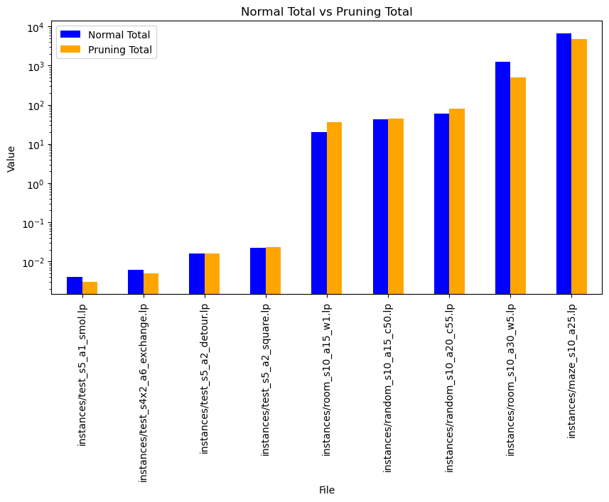

# MAPF_Problem
Seminar project

Team: Lkhagvasuren Rentsenbyamba, Felix Kratzsch 
## Project: MAPF with pruning in ASP
### Goal
Using ASP to simplify and solve MAPF instances.

### Encoding
Our encoding was based on the paper [1], which we discussed in the seminar. All given instances are solved by our solver with and without pruning. We considered a vertex and edge (swap) conflicts that agents are not allowed to possess a same vertex or swap positions at same time. 
 
For the prunning, we did not take the idea of the paper [1]. Instead, we just implemented reachable vertices from start positions to end postions, so that we can constrain the unreacheable verticies. Interestingly, some given instances are solved slower with the pruning than without. That propably relates to the additional overhead, which is generated even if there is no advantage to it.



_Generated via the codings in the evaluation folder._

There is just one given instance, which is 'maze_s10_a30.lp' that our encoding did not solve within a time limit of three hours. But that only means the pruning-encoding. Our normal one did solve it in around two hours.

### Usages
The encodings can be found in the folder encodings and are used with the instances in the following way:
```
clingo instances/test_s5_a2_exchange\(hard\).lp encodings/encoding.lp
```

To use the visualizer as well some additions are needed:
```
clingo instances/test_s5_a2_exchange\(hard\).lp encodings/encoding.lp encodings/mif_to_asprilo.lp | viz
```

### References 
1.    Husár, M., Švancara, J., Obermeier, P., Barták, R., Schaub, T.: Reduction-based
   Solving of Multi-agent Pathfinding on Large Maps Using Graph Pruning. AAMAS
   2022, May, Online. (2022).

### Sources
**Asprilo vizualiser:** https://asprilo.github.io/visualizer/
